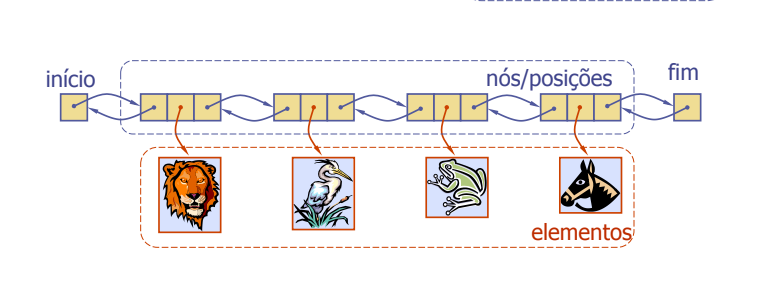
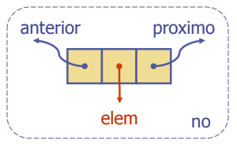

# Lista
- O TAD Lista modela um sequência de posições armazenando objetos quaisquer
- Ele estabelece uma relação antes/depois entre posições

## Métodos genéricos
- size(), isEmpty()

## Métodos de fila:
- isFirst(n), isLast(n)

## Métodos para acessar:
- first(), last()
- before(p), after(p)

## Métodos para atualizar:
- replaceElement(n, o), swapElements(n, q)
- insertBefore(n, o), insertAfter(n, o),
- insertFirst(o), insertLast(o)
- remove(n)

# Lista duplamente encadeada
- Uma lista duplamente encadeada provê uma implementação natutal do TAD Lista
- Nós implementam Posições e armazenam:
> elemento

> referência ao nó anterior
 
>referência ao nó posterior

- Nós especiais para início e fim

## Algoritmo de inserção
- A operação insertAfter(p, X), que retorna uma posição q
~~~
Algoritmo insertAfter(p,e):
    Criar novo nó q
    q.setElement(e)
    q.setPrev(p) // v referencia seu anterior
    q.setNext(p.getNext()) // referencia seu posterior

    (p.getNext()).setPrev(q) // anterior do próximo de p agora é v

    p.setNext(q) // próximo de p é o novo nó v
    return q // A posição do elemento e
~~~

## Algoritmo de remoção
- A operação remove(p), onde = last()
~~~
Algoritmo remove(p):
    t = n.element {Variável temporária para armazenar valor de retorno}

    (p.getPrev()).setNext(p.getNext())
                            {“desreferenciando” n}
    (p.getNext()).setPrev(p.getPrev())

    p.setPrev(null) {invalidando em n}
    p.setNext(null)
    return t
~~~
