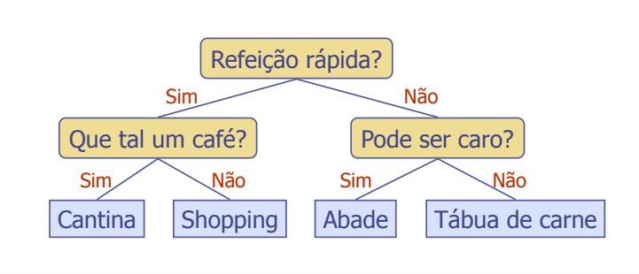

# Árvore
## O que é uma árvore?
- Em Computação, é um modelo abstrato de uma estrutura hierárquica
- Uma árvore consiste de nós com uma **relação pai-filho**

## Terminologia de árvore
- Raiz (root): Nó sem pai (A). O nó head de uma lista ligada, por exemplo
- Nó interno: Nó com, pelo menos, um filho (A, B, C, F)
- Nó externo: Também chamado de Nó Folha. Nó sem filhos (E, I, J, K, G, H, D)
- Ancestral de um nó: pai, avô, bisavô, etc.
- Profundidade de um nó: Número de ancestrais. Contagem do que vem antes de um determinado nó
- Altura de um árvore: Profundidade máxima (3). Para definir a altura, pegar a maior altura entre os "galhos". Para isso, não pode contar o nó root 
- Descendente de um nó: filho, neto, bisneto, etc.
- Sub-árvore: árvore formada por um nó e seus descendentes

## Métodos:
#### Métodos genéricos
- integer size()
- integer height()
- boolean isEmpty()
- Iterator elements() -> itera apenas sobre os elementos
- Iterator nos() -> itera a penas sobre os nós
#### Métodos de acesso:
- No root()
- No parent(No)
- Iterator children(No)

#### Métodos de consulta:
- boolean isInternal(No)
- boolean isExternal(No)
- boolean isRoot(No)
- integer depth(No)
#### Métodos de atualização:
- Object replace(No, o)
> Métodos adicionais podem ser definidos pela estrutura que extende/implementa o TAD árvore

## Travessia pré-ordem
- Visita-se primeiro o pai para depois visitar os filhos

~~~
Algoritmo preOrder(v)  -> recebe um nó (sempre o raiz primeiro)
    visite(v) 
    para cada filho w de v
    preorder (w)
~~~

## Travessia pós-ordem
- Visita primeiro os filhos
~~~
Algoritmo postOrder(v)
    para cada filho w de v
        postOrder(w)
    visite(v)
~~~

## Árvore Binária
- Uma árvore binária é uma árvore com as seguintes propriedades:
- Cada nó interno tem, no máximo, dois filhos
    - Arvore binária própria é aquela em que cada nó tem exatemente zero ou dois filhos
- Os filhos de um nó é um par ordenado

### Árvore de decisão
- Árvore binária associada com um processo de decisão
- Nós internos: questões com respostas sim/não
- Nós externos: decisões

> Exemplo: Onde jantar

### Propriedades de Árvore Binária (BT)
> OBS: a altura (h) influencia no desempenho de outros métodos

Notação
**n** - número de nós
**e** - número de nós externos
**i** - número de nós internos
**h** altura (height)

Propriedades:

**e** = i + 1

**n** = 2e - 1

**h** ≤ i

**h** ≤ (n - 1)/2

**e** ≤ 2h

**h** ≥ log2 e

**h** ≥ log2 (n + 1) - 1

## TAD Árvore Binária
- Herda todos os métodos de árvore mais outros métodos específicos
Métodos adicionais:
- Nó leftChild(v)
    - Retorna o filho esquerdo de V
- Nó rightChild(v)
    - Retorna o filho esquerdo de V
- Nó hasLeft(v)
    - Retorna se V tem filho esquerdo
- Nó hasRight(v)
    - Retorna se V tem filho direito

## Travessia em ordem (exclusivo de árvores binárias)
Na travessia inorder, um nó é visitado depois do filho da esquerda e antes do filho da direita
~~~
Algoritmo inOrder(v)
se (isInternal (v))
    inOrder (leftChild (v))
visite(v)
se ( isInternal (v))
    inOrder (rightChild (v))

Algoritmo visite(v)
    matriz[profundidade(v), i] = v
~~~

~~~java
// Imprimir árvore na tela
for (int l = 0; l < altura+1; l++>){
    for (int c = 0; c < size(); c++>){
        System.out.print(matriz[l, c]);
    }
}
~~~

## Nó para árvores
- **Elemento:** Object
- **Nó pai**
- **Nó filhos**

~~~java
class No{
    private Object elemento;
    private No pai;
    private ArrayList No filhos;
}
~~~

## Nó para árvores binárias
- Elemento
- Nó pai
- Filho da esquerda
- Filho da direita

## Implementação de árvore binária com array
- Para percorrer, utiliza-se a técnica da multiplicação
> acessar o item à esquerda: multiplica o índice atual por 2

> acessar o item à direita: o resultado da multiplicação acima soma com 1 

- Para saber qual é o pai, divido o índice do filho por 2
- Utilizar array se houver certeza que a árvore estará cheia

## Árvore Binária de pesquisa
- Uma árvore de pesquisa binária é uma árvore binária armazenando chaves (ou itens) em seus nós internos e satisfazendo a seguinte propriedade:
    - Seja u, v e w três nós tais que u é nó esquerdo de v e w é o nó direito. Temos key(u) ≤ key(v) ≤ key(w)
- O filho esquerdo do pai sempre será obrigatoriamente menor que o pai e o filho direito será maior
- Para fins didáticos, não existe chave repetida
- Sempre será O(h) -> h =  altura da árvore (log n)
- A árvore cresce nas folhas, nunca nos nós internos
- Remoção é diferente: pode remover de qualquer lugar

~~~
Algoritmo TreeSearch(elemento_busca, raiz)
    se T.isExternal (raiz) 
        retorne raiz
    se k < key(raiz)
        retorne TreeSearch(elemento_busca, T.left(raiz))
    senão se elemento_busca = key(raiz)
        retorne raiz
    senão { k > key(raiz) }
        retorne TreeSearch(elemento_busca, T.right(raiz))
~~~

## Inserção

## Remoção
- Existem 3 casos de remoção
1. Remover um nó sem filhos: o nó vira null
2. Remover o nó com apenas um filho: o filho desse nó agora será filho do pai do nó que foi removido
3. Remover o nó com dois filhos: ir para subárvore direita, pego o elemento (atual) e vou verificando enquanto houver filho esquerdo. O sucessor do nó que iremos remover será esse atual. Encontrei o menor, ele vai para o lugar do nó que eu quero remover. A árvore inteira deve ser remanejada
